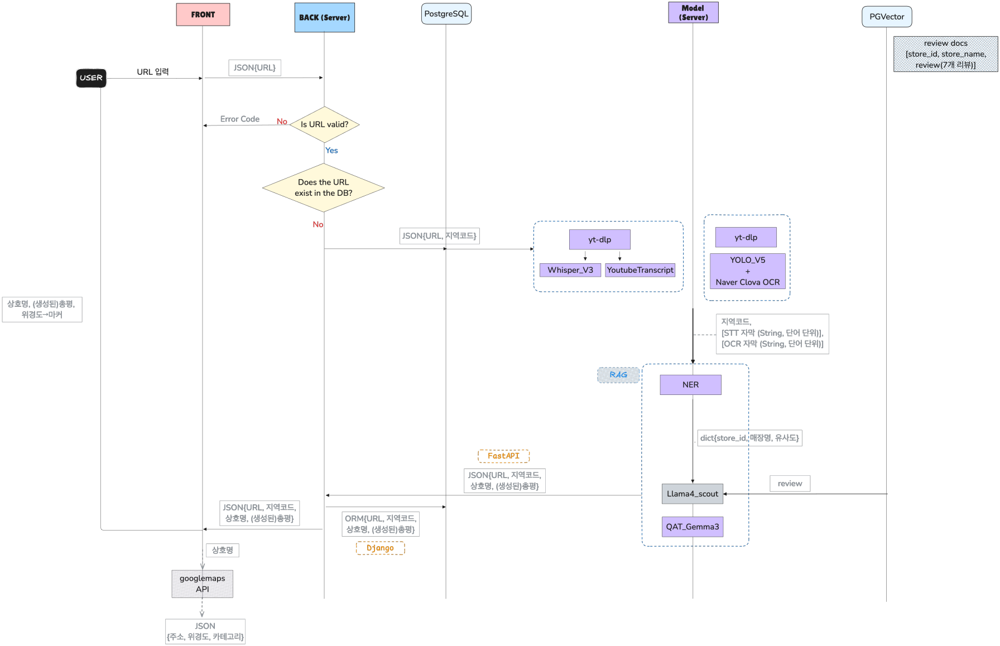

# 💻 GABOLJIDO

  

## 💡 Project Introduce
- 2025.04.07 - 2025.04.25
- AI를 활용한 숏폼 영상 기반 
장소 정보 제공 및 요약 서비스
    
 
## 🧞‍♂️ Service video

  

  

## 📋 MSA structure

    

## 📄 Project Docs
- [Notion Link](https://gyukim.notion.site/1ced5a85c434800ca230ff48797ad396?pvs=4)
- [GitHub Organization]()
  

## 📁 Directories

  

## 🤖 Model
### MODEL pipeline

  

## 📈 Data Flow Chart

  

## 🛠️ Tech Stack

### Frontend
      

### Backend
  
 
  

### Data engineering & Modelling

   
 
   
 

### Server Infra
  

### Team Tools
    

